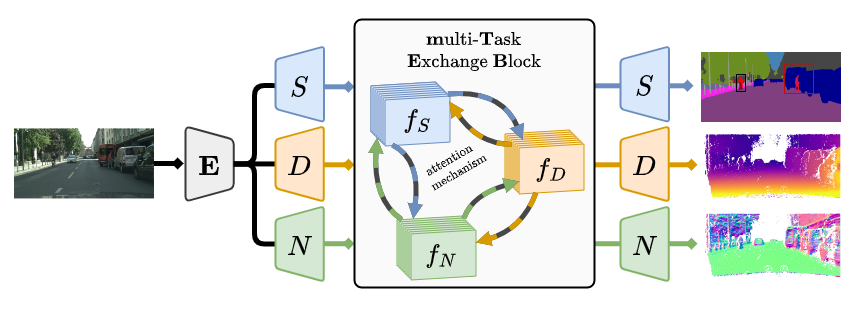

# Cross-task Attention Mechanism for Dense Multi-task Learning

**Cross-task Attention Mechanism for Dense Multi-task Learning**] \[[arXiv](https://arxiv.org/abs/2206.08927)\] \
Ivan Lopes<sup>1</sup>,
[Tuan-Hung Vu<sup>2</sup>](https://tuanhungvu.github.io/),
[Raoul de Charette<sup>1</sup>](https://team.inria.fr/rits/membres/raoul-de-charette/)
<sup>1</sup> Inria, Paris, France.
<sup>2</sup> Valeo.ai, Paris, France.


Code is coming soon, [stay tuned](https://github.com/cv-rits/DenseMTL/watchers) for its release!



To cite our paper, please use:
```
@article{lopes2022densemtl,
  title={Cross-task Attention Mechanism for Dense Multi-task Learning},
  author={Lopes, Ivan and Vu, Tuan-Hung and de Charette, Raoul},
  journal={arXiv preprint},
  year={2022}
}
```
